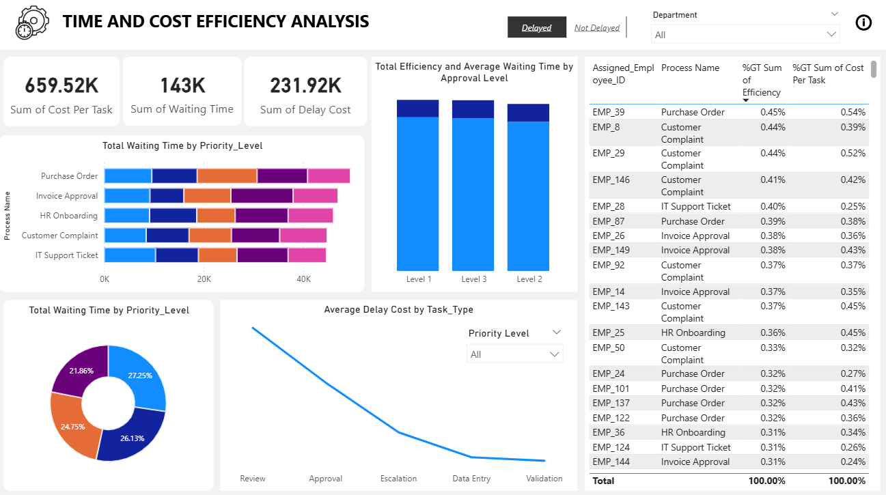

# Workflow Operations Performance Analysis


An end-to-end data analysis project focused on **time efficiency** and
**cost optimization** in workflow operations. This project uncovers
bottlenecks, quantifies delays, and estimates the impact of automation
on operational performance.

------------------------------------------------------------------------

## Overview

Organizations often lose significant productivity due to: - Delays in
approvals
- System inefficiencies
- Poor workload distribution

This project analyzes workflow data to: - Measure **time
inefficiencies** - Identify **delay patterns** - Quantify **cost
impact** - Recommend **automation opportunities**


------------------------------------------------------------------------

## Tech Stack

-   Python
-   Pandas
-   Matplotlib
-   Seaborn
-   Jupyter Notebook
-   PowerBI


------------------------------------------------------------------------

## Dataset

The dataset contains task-level workflow records with attributes such
as:

-   Workflow_ID
-   Process_Name
-   Task_ID
-   Task_Type
-   Priority_Level
-   Department
-   Assigned_Employee_ID
-   Task_Start_Time
-   Task_End_Time
-   Estimated_Time_Minutes
-   Actual_Time_Minutes
-   Delay_Flag
-   Approval_Level
-   Employee_Workload
-   Cost_Per_Task


------------------------------------------------------------------------

## Data Cleaning & Feature Engineering

-   Converted timestamp columns to datetime
-   Created derived metrics such as: Waiting Tim, Efficiency Ratio, Delay indicators.


------------------------------------------------------------------------

## Key Metrics Analyzed

Time Efficiency Metrics
- Task Completion Time
- Estimated vs Actual Time
- Waiting Time (Delay)
- Downtime (via Delay Flag)
- Efficiency Ratio

 Cost Metrics
- Cost per Task
- Total Operational Cost
- Delay-Induced Cost
- Cost per Unit

------------------------------------------------------------------------

## Dashboard



------------------------------------------------------------------------

## Key Insights

-   ~30% of total time is lost to delays
-   Approval levels increase waiting time
-   Delays increase operational cost
-   Total Waiting Time is 31.56% of the actual time
-   Percentage efficiency is at 67%
-   The Department with the highest waiting time is Finance with the average of 57minuites of waiting time
-   94% of all tasks were delayed
-   About **33.3%** of every cost per task is attributed to delay cost. Therefore, reducing waiting time would directly lead to a decrease in the overall operational cost.

------------------------------------------------------------------------

## Getting Started

``` bash
git clone repo
cd workflow-analysis
pip install pandas matplotlib seaborn
jupyter notebook
```

------------------------------------------------------------------------


